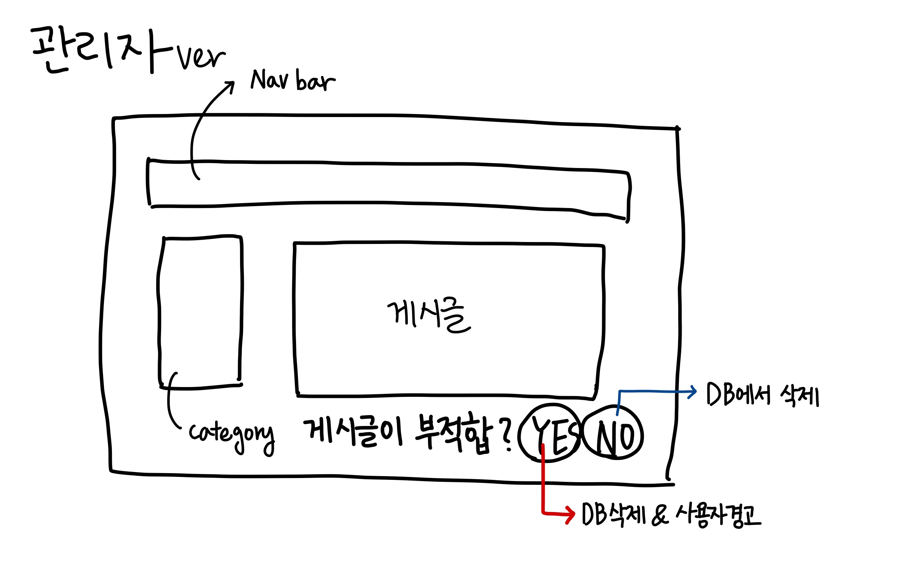

# 기능 A : 자연어 처리

## 기능 설명

### 목적

> 게다가 좋은 인연을 찾아 감사하다는 **훈훈한 이야기보다 불륜과 학연을 이용한 사기사건** 등이 사람들의 입에 오르내리면서 많은 회원들이 빠져나갔다.
새로운 수익사업을 찾는 데도 실패했다. 회원들이 동창을 찾고 모임을 만들면 아이러브스쿨의 역할은 그걸로 끝이었다.
회원들이 아이러브스쿨을 다시 찾을 필요를 느끼지 못한 것이다.

> 새로운 사업이나 서비스가 절실한 상황이었다. 
아이러브스쿨이 방향을 잃기 시작하자 후발 주자인 ‘다모임’이 서비스에 변화를 주면서 2002년부터는 아이러브스쿨을 추월했다. 
이런 상황에 현명호 대표가 구원투수로 등장해 ‘회사 정상화’에 힘을 기울였다.
운영을 맡은 첫해에 수익을 냈지만 오래 가지 못했다. 이는 현 대표도 예상한 부분이었다.
동창이라는 특성이 오랜만에 만나면 반갑지만 자주 만나면 즐겁지 않은 일이 생기듯 아이러브스쿨도 변화가 필요했다.
사진, 동영상, 기타 개인자료 등 **개인화 서비스를 강화하고 불륜이나 사기 등 불미스러운 사건으로 떨어진 기업 이미지를 다시 높이기 위한 변화에 나섰지만, 결과적으로 아무런 소득이 없었다**.
[기사 원문](http://www.ilovepc.co.kr/news/articleView.html?idxno=2780)

아이러브스쿨은 '인터넷에서 학교 동문을 찾아주는 서비스'로 큰 인기를 얻었지만, 사기와 불륜 등의 불법 게시글의 문제점으로 많은 사용자들에게 불편함을 안겨주었다.
이를 보완하고자 릴레이 프로젝트 **`<다시모임`** 에서는 사용자들의 게시글을 자연어 처리 기술로 불법 게시글을 근절시키고자 한다.

- 사용자가 게시글을 작성하면 게시글 DB에 업로드하고 게시글의 내용을 `형태소 분석`한다.
- 만약 분석된 결과에 미리 지정해 둔 금지어가 일정 비율 존재한다면 `부적합 게시글 DB`에 게시글의 ID를 추가한다.
- 관리자는 관리자 페이지에서 `부적합 게시글 DB`에 있는 게시글의 목록을 확인할 수 있다.
- 게시글을 읽고 부적합한 글인지 아닌지 서버에 결과값을 보내고 서버는 `부적합 게시글 DB`에서 제거한다.
- 부적합한 글이었을 경우 서버는 게시글을 작성한 사용자에게 `경고` 횟수를 증가시킨다.

### 부적합한 단어를 모은 Data set `dataset/`
- abuse : 비속어
- fraud : 사행성과 관련된 단어

### 예상 문제점
- 금칙어 기반 라이브러리의 경우 우회 욕설 타이핑이 가능하다. [참고](https://www.youtube.com/watch?v=K4nU7yXy7R8)
- 오타, 의도가 다르게 사용한 단어로 게시글이 추출될 수 있다.
- 데이터 셋에 담을 단어를 결정하는데 애매하거나 주관적인 부분이 있다.

## 예상 UI

## 관련 라이브러리 및 API

### 인공지능 기반 한국어 비속어 필터링 오픈소스 API

> https://github.com/hjh010501/appropriate-filetering

인공지능을 기반으로 하여 문장의 비속어를 파악하는 HTTP API  
음소, 음절별로 문장을 분해하여 인공지능을 통해 비속어 여부를 분석 할 수 있습니다.

### Python 한국어 LNP를 위한 패키지

> https://konlpy-ko.readthedocs.io/ko/v0.4.3/

java 기반의 형태소 분석기를 파이썬에서 사용할 수 있게 해주는 패키지

사용 예제 : [파이썬_konlpy_kkma(꼬꼬마) 형태소 분석기 사전 튜닝](https://cromboltz.tistory.com/18)

### 카카오 형태소 분석기

> https://github.com/kakao/khaiii

데이터(혹은 기계학습) 기반의 알고리즘을 이용하여 분석하여 형태소를 분석한다.

### 은전한닢 : 오픈소스 한국어 형태소 분석기

> http://eunjeon.blogspot.com/

은전한닢 프로젝트는 “검색에서 쓸만한 오픈소스 한국어 형태소 분석기를 만들자!” 라는 생각으로 시작하게 된 프로젝트입니다.
‘검색에서 쓸만한’이란 목표 때문에 다음의 두 가지 항목에 초점을 맞춰 개발을 진행하였습니다.
- 검색 엔진 색인기에서 쓸 수 있는 적당한 품질과 속도
- 자유로운 라이센스

Python에 은전한닢 연동하기 위한 인터페이스 [링크](https://github.com/koshort/pyeunjeon)

---

### 읽어보면 좋을 자료
- [게시글 필터링 - 당근마켓](https://medium.com/daangn/%EB%94%A5%EB%9F%AC%EB%8B%9D%EC%9C%BC%EB%A1%9C-%EB%8F%99%EB%84%A4%EC%83%9D%ED%99%9C-%EA%B2%8C%EC%8B%9C%EA%B8%80-%ED%95%84%ED%84%B0%EB%A7%81%ED%95%98%EA%B8%B0-263cfe4bc58d)
- [LSTM으로 글 분류하기](https://bangseogs.tistory.com/96)